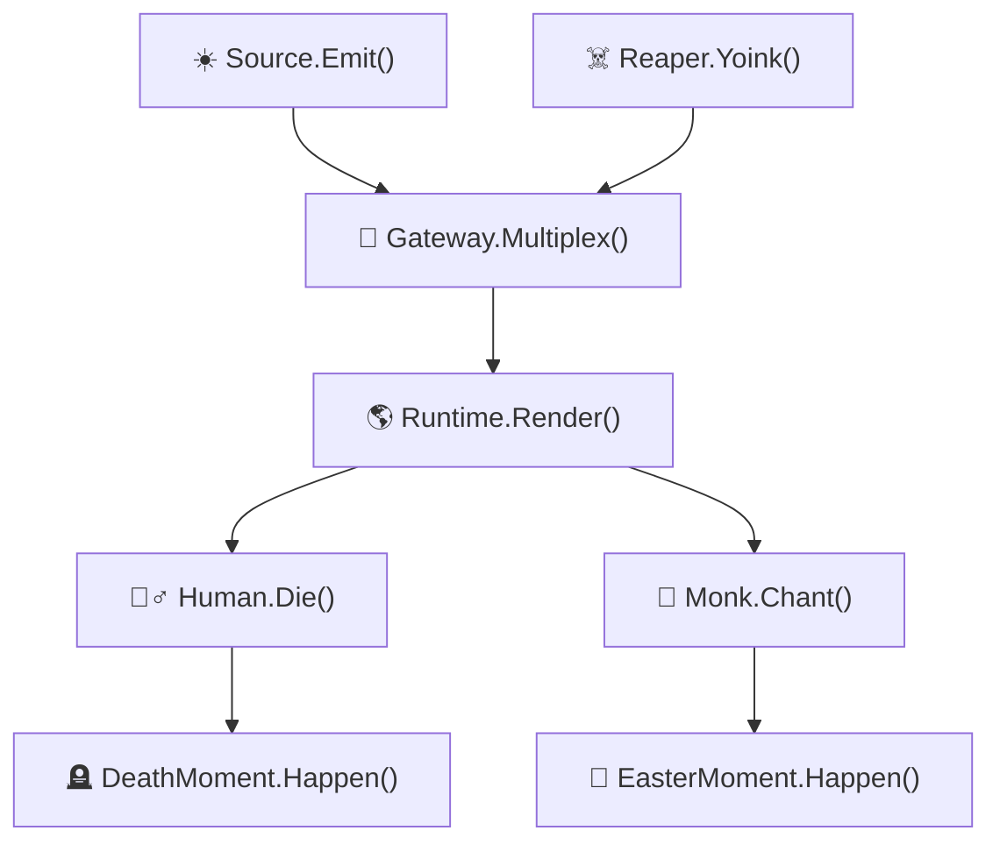

# MVC

```mermaid
flowchart TD
  Source["☀️ Source.Emit()"] --> Gateway["🌙 Gateway.Multiplex()"]
  Reaper["☠️ Reaper.Yoink()"] --> Gateway["🌙 Gateway.Multiplex()"]
  Gateway --> Runtime["🌎 Runtime.Render()"]
  Runtime --> Human["🧍‍♂️ Human.Die()"]
  Human --> DeathMoment["🪦 DeathMoment.Happen()"]
  Runtime --> Calendar["📆 Monk.Chant()"]
  Calendar --> Moment["🎉 EasterMoment.Happen()"]
```
